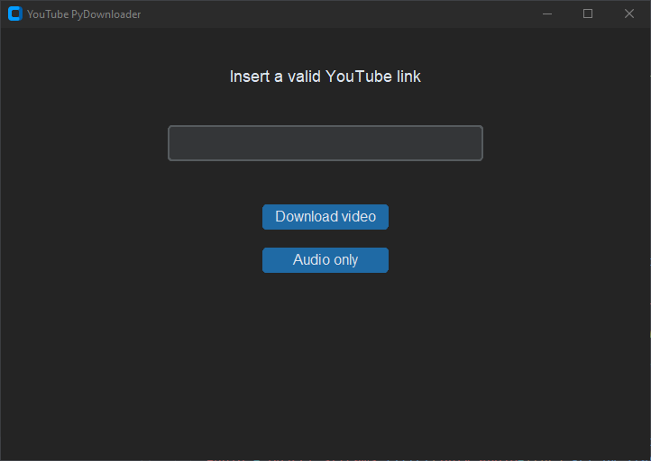

<div align="center">
    
</div>
<h1 align="center">YT PyDownloader</h1> 
<h2 align="center">A YouTube downloader written in Python 🐍</h2>

<div align="center">
    
</div>

### Disclaimer ⚠

**This is quick script I made for learning purposes, how it is used is none of my business.**

### Tools used 🧰

- [Python310](https://www.python.org/)
- [PyTube](https://pytube.io/)
- [Tkinter](https://docs.python.org/3/library/tkinter.html)
- [CustomTkinter](https://github.com/TomSchimansky/CustomTkinter)
- [Visual Studio Code](https://code.visualstudio.com/)

### Setup 🛠

Assuming that you have Python installed:

1. Clone this repo, then `cd` into it

```
git clone https://github.com/rwxdan/yt-pydownloader/ && cd yt-pydownloader
```

2. Install the needed dependencies with [pip](https://pypi.org/project/pip/)

   ❗ I'll suggest to create a `venv`, [learn more](https://docs.python.org/3/tutorial/venv.html). Or else, just follow along.

```
pip install pytube customtkinter
```

3. Run 🚀

Either launch it from your terminal

```
python3 ./yt_downloader.py
```

Or if you aren't using a `venv`, just double-click on the file.

### Usage 💡

Simple enough:

1. Enter a valid YouTube link
2. Click one of the two buttons depending on your needs
3. Look inside the project folder
4. Voila

At the moment, it only downloads videos at their higher resolution, and `m4a` encoded audio files.

### TODO (maybe):

- Custom download destination path
- Support for playlists
- Support for custom resolutions, ABRs and output formats
